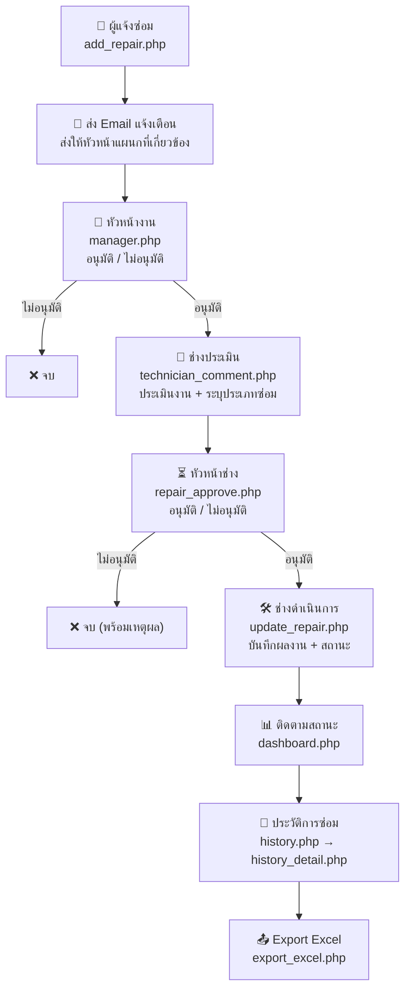

# 📄 ระบบยานยนต์และแจ้งซ่อมบำรุง — System Documentation

> **เวอร์ชัน:** 1.0  
> **วันที่จัดทำ:** 23 กุมภาพันธ์ 2569  
> **Tech Stack:** PHP 8.x · MySQL · Bootstrap 5.3.3 · Font Awesome 6 · Chart.js · PHPMailer · PhpSpreadsheet · Select2

---

## สารบัญ

1. [ภาพรวมระบบ](#1-ภาพรวมระบบ)
2. [โครงสร้างไฟล์](#2-โครงสร้างไฟล์)
3. [ฐานข้อมูล](#3-ฐานข้อมูล)
4. [ระบบ Authentication & Role-Based Access](#4-ระบบ-authentication--role-based-access)
5. [Workflow การซ่อมบำรุง](#5-workflow-การซ่อมบำรุง)
6. [รายละเอียดแต่ละหน้า](#6-รายละเอียดแต่ละหน้า)
7. [ระบบ Email แจ้งเตือน](#7-ระบบ-email-แจ้งเตือน)
8. [ระบบ Export Excel](#8-ระบบ-export-excel)
9. [Frontend & UI](#9-frontend--ui)
10. [Dependencies](#10-dependencies)

---

## 1. ภาพรวมระบบ

ระบบยานยนต์และแจ้งซ่อมบำรุง เป็น Web Application สำหรับ **กองกายภาพและสิ่งแวดล้อม มหาวิทยาลัยสงขลานครินทร์** ใช้บริหารจัดการยานพาหนะและกระบวนการซ่อมบำรุง ครอบคลุมตั้งแต่การแจ้งซ่อม → ประเมินโดยช่าง → อนุมัติ → ดำเนินการซ่อม → บันทึกประวัติ

**URL ใช้งานจริง:** `https://carpse.psu.ac.th`

### คุณสมบัติหลัก
- จัดการข้อมูลรถยนต์ / รถจักรยานยนต์
- แจ้งซ่อมออนไลน์ พร้อมส่ง Email แจ้งเตือนอัตโนมัติ
- ช่างประเมินงานซ่อม ระบุประเภทซ่อม (ภายใน/ภายนอก)
- อนุมัติงานซ่อม 2 ระดับ (หัวหน้างาน + หัวหน้าช่าง)
- ช่างบันทึกผลงานซ่อม พร้อมรายการอะไหล่/ค่าใช้จ่าย
- ติดตามสถานะงานซ่อมแบบ Real-time
- Dashboard ภาพรวมระบบ พร้อมกราฟ
- บันทึก/ส่งออกประวัติการซ่อม (Excel)
- ระบบสิทธิ์ 5 ระดับ (RBAC)

---

## 2. โครงสร้างไฟล์

```
Car_repair/
│
├── 🔐 Authentication
│   ├── login.php              # หน้าเข้าสู่ระบบ
│   ├── login.css              # สไตล์หน้า Login
│   ├── auth_login.php         # ตรวจสอบ username/password
│   ├── logout.php             # ออกจากระบบ (destroy session)
│   └── update_password.php    # สคริปต์เปลี่ยนรหัสผ่าน (utility)
│
├── 🏠 Core Layout
│   ├── index.php              # หน้าหลัก (SPA-like layout: sidebar + routing)
│   ├── index.css              # สไตล์ layout หลัก + sidebar + animations
│   └── tabs.css               # สไตล์ tabs component
│
├── 🚗 จัดการรถ
│   ├── car_list.php           # รายการรถ (ค้นหา, กรองประเภท, pagination, ลบ)
│   ├── car_list.css           # สไตล์ตารางรายการรถ
│   ├── add_car.php            # เพิ่มข้อมูลรถใหม่
│   ├── add_car.css            # สไตล์ฟอร์มเพิ่ม/แก้ไขรถ
│   └── edit_car.php           # แก้ไขข้อมูลรถ
│
├── 🔧 แจ้งซ่อมบำรุง
│   ├── add_repair.php         # ฟอร์มแจ้งซ่อม + ส่ง email
│   ├── save_repair.php        # บันทึก repair_details (ใช้จาก update_repair)
│   ├── technician_comment.php # ช่างประเมินงานซ่อม
│   ├── repair_approve.php     # หน้าอนุมัติงานซ่อม (หัวหน้าช่าง)
│   └── update_repair.php      # ช่างบันทึกผลงานซ่อม + อะไหล่
│
├── 📊 Dashboard & สถานะ
│   ├── dashboard.php          # ตารางสถานะงานซ่อม
│   ├── dashboard.css          # สไตล์ dashboard
│   ├── dashboard_home.php     # ภาพรวมระบบ (กราฟ + อันดับ)
│   └── manager.php            # หน้าหัวหน้างาน (อนุมัติใบแจ้งซ่อม)
│   └── manager.css            # สไตล์หน้าหัวหน้างาน
│
├── 📁 ประวัติการซ่อม
│   ├── history.php            # รายการรถ → ดูประวัติ
│   ├── history_detail.php     # รายละเอียดประวัติการซ่อมรายคัน
│   ├── history_detail.css     # สไตล์หน้า history detail
│   ├── add_history.php        # เพิ่มประวัติซ่อมย้อนหลัง
│   ├── add_history.css        # สไตล์ฟอร์มเพิ่มประวัติ
│   └── export_excel.php       # ส่งออกประวัติซ่อมเป็น .xlsx
│
├── 👥 จัดการผู้ใช้
│   ├── manage_users.php       # สร้างผู้ใช้งานใหม่
│   └── manage_users.css       # สไตล์หน้าจัดการผู้ใช้
│
├── 📧 Email & Utility
│   ├── send_email.php         # ฟังก์ชันส่ง email (PHPMailer)
│   ├── test_email.php         # ทดสอบส่ง email
│   └── db.php                 # เชื่อมต่อ MySQL
│
├── 📦 Assets & Dependencies
│   ├── logo.png               # โลโก้ระบบ
│   ├── pse.png                # โลโก้หน้า Login
│   ├── composer.json          # PHP dependencies
│   ├── vendor/                # Composer packages
│   └── templates/             # Excel template
│       └── templates.xlsx     # Template สำหรับ export
```

---

## 3. ฐานข้อมูล

**Database:** `car_repair` (MySQL, charset: UTF-8)

### 3.1 ตารางหลัก

#### `users` — ผู้ใช้งาน
| Column       | Type         | Description              |
|-------------|-------------|--------------------------|
| `id`        | INT (PK, AI)| รหัสผู้ใช้              |
| `username`  | VARCHAR      | ชื่อผู้ใช้              |
| `password`  | VARCHAR      | รหัสผ่าน (bcrypt hash)   |
| `role`      | VARCHAR      | สิทธิ์ (5 ระดับ)        |
| `department`| VARCHAR      | แผนก (สำหรับ manager)   |

#### `cars` — ข้อมูลรถ
| Column          | Type         | Description              |
|----------------|-------------|--------------------------|
| `id`           | INT (PK, AI)| รหัสรถ                  |
| `license_plate`| VARCHAR      | ทะเบียนรถ               |
| `brand_model`  | VARCHAR      | ยี่ห้อ/รุ่น             |
| `vehicle_type` | VARCHAR      | ประเภท (รถยนต์/รถจักรยานยนต์) |
| `asset_code`   | VARCHAR      | รหัสครุภัณฑ์            |
| `department`   | VARCHAR      | หน่วยงาน               |
| `responsible`  | VARCHAR      | ผู้รับผิดชอบ            |
| `tax_expire`   | DATE         | วันหมดอายุภาษี          |
| `note`         | TEXT         | หมายเหตุ                |

#### `repair_requests` — ใบแจ้งซ่อม
| Column                | Type         | Description                     |
|----------------------|-------------|---------------------------------|
| `id`                 | INT (PK, AI)| รหัสใบแจ้งซ่อม                |
| `car_id`             | INT (FK)     | รหัสรถ → `cars.id`            |
| `request_item`       | TEXT         | รายการแจ้งซ่อม                |
| `responsible`        | VARCHAR      | ผู้แจ้งซ่อม                   |
| `Department`         | VARCHAR      | สังกัด/แผนก                   |
| `request_date`       | DATE         | วันที่แจ้งซ่อม                |
| `note`               | TEXT         | หมายเหตุ                      |
| `approve_status`     | VARCHAR      | สถานะอนุมัติจากหัวหน้างาน (รออนุมัติ/อนุมัติ/ไม่อนุมัติ) |
| `technician_comment` | TEXT         | ความเห็นช่าง                  |
| `repair_type`        | VARCHAR      | ประเภทซ่อม (ภายใน/ภายนอก)    |
| `repair_approve`     | VARCHAR      | สถานะอนุมัติจากหัวหน้าช่าง (รออนุมัติ/อนุมัติ/ไม่อนุมัติ/ประวัติ) |
| `reject_remark`      | TEXT         | หมายเหตุไม่อนุมัติ            |
| `tech_submit_status` | VARCHAR      | สถานะการส่งจากช่าง (submitted) |
| `status`             | VARCHAR      | สถานะงานซ่อมปัจจุบัน          |

#### `repair_details` — รายละเอียดงานซ่อม
| Column                | Type         | Description              |
|----------------------|-------------|--------------------------|
| `id`                 | INT (PK, AI)| รหัสรายละเอียด          |
| `repair_id`          | INT (FK)     | → `repair_requests.id`  |
| `mechanic_note`      | TEXT         | บันทึกช่าง              |
| `cost`               | DECIMAL      | ค่าใช้จ่ายรวม           |
| `responsible`        | VARCHAR      | ผู้ประเมิน/ช่างผู้ทำ    |
| `operator`           | VARCHAR      | ช่างผู้ดำเนินการ        |
| `status`             | VARCHAR      | สถานะงาน               |
| `repair_date`        | DATE         | วันที่ซ่อม              |
| `enter_date`         | DATE         | วันที่ลงรายการ (ประวัติ) |
| `responsible_company`| VARCHAR      | ผู้ดำเนินการ/อู่ซ่อม    |
| `notes`              | TEXT         | หมายเหตุ               |
| `remarks`            | TEXT         | หมายเหตุช่าง            |

#### `repair_items` — รายการอะไหล่/ชิ้นส่วน
| Column      | Type         | Description              |
|------------|-------------|--------------------------|
| `id`       | INT (PK, AI)| รหัสรายการ              |
| `repair_id`| INT (FK)     | → `repair_requests.id`  |
| `item_name`| VARCHAR      | ชื่อรายการ/อะไหล่       |
| `quantity` | INT          | จำนวน                   |
| `unit`     | VARCHAR      | หน่วย                   |
| `price`    | DECIMAL      | ราคา                    |

### 3.2 Views (ใช้ใน Dashboard)

| View Name                   | Description                              |
|-----------------------------|------------------------------------------|
| `v_dashboard_car_status`    | สรุปจำนวนรถแยกตามสถานะ                 |
| `v_top_repair_cars`         | อันดับรถที่ซ่อมบ่อย (แยกตามปี)          |
| `v_repair_cost_by_year_car` | ค่าซ่อมรวมแยกตามรถและปี                |

---

## 4. ระบบ Authentication & Role-Based Access

### 4.1 การเข้าสู่ระบบ

```
login.php → ฟอร์ม username/password
    ↓
auth_login.php → ตรวจสอบผ่าน password_verify()
    ↓
สำเร็จ:   เก็บ Session → redirect ไป index.php?page=home
ล้มเหลว:  alert แจ้งเตือน → กลับหน้า login
```

**Session Variables:** `user_id`, `username`, `role`, `department`

### 4.2 สิทธิ์ผู้ใช้งาน (5 ระดับ)

| Role                | ไทย               | สิทธิ์การเข้าถึง                                                                    |
|--------------------|--------------------|--------------------------------------------------------------------------------------|
| `admin`            | ผู้ดูแลระบบ        | เข้าถึงทุกหน้า + จัดการผู้ใช้ + CRUD ข้อมูลรถ + อนุมัติทุกแผนก                      |
| `owner`            | เจ้าของรถ          | ดูรายการรถ (อ่านอย่างเดียว) + ดูสถานะ + ดูประวัติ + ดูหัวหน้างาน (ไม่สามารถอนุมัติ) |
| `technician`       | ช่าง               | ช่างประเมิน + งานช่าง + ดูสถานะ + อนุมัติซ่อม (ดูอย่างเดียว)                        |
| `manager`          | หัวหน้างาน         | ดูรายการรถ (read-only) + หัวหน้างาน (อนุมัติ) + ประวัติ + ภาพรวม                     |
| `chief_technician` | หัวหน้าช่าง        | ทุกอย่างของช่าง + เพิ่ม/แก้ไขรถ + แจ้งซ่อม + อนุมัติงานซ่อม + ภาพรวม               |

### 4.3 ตาราง Sidebar Menu Access

| หน้า             | admin | owner | technician | manager | chief_technician |
|-----------------|:-----:|:-----:|:----------:|:-------:|:----------------:|
| หน้าหลัก        |  ✅   |  ✅   |    ✅      |   ✅    |       ✅         |
| รายการรถ        |  ✅   |  ✅   |    ❌      |   ❌    |       ✅         |
| แจ้งซ่อม        |  ✅   |  ✅   |    ❌      |   ❌    |       ✅         |
| ช่างประเมิน     |  ✅   |  ❌   |    ✅      |   ❌    |       ✅         |
| งานช่าง         |  ✅   |  ❌   |    ✅      |   ❌    |       ✅         |
| สถานะรถ         |  ✅   |  ✅   |    ✅      |   ❌    |       ✅         |
| ประวัติการซ่อม  |  ✅   |  ✅   |    ❌      |   ✅    |       ✅         |
| หัวหน้างาน      |  ✅   |  ✅   |    ❌      |   ✅    |       ❌         |
| งานซ่อมรออนุมัติ|  ✅   |  ❌   |    ✅      |   ❌    |       ✅         |
| จัดการผู้ใช้งาน |  ✅   |  ❌   |    ❌      |   ❌    |       ❌         |
| ภาพรวมระบบ      |  ✅   |  ❌   |    ❌      |   ✅    |       ✅         |

---

## 5. Workflow การซ่อมบำรุง



### สถานะงานซ่อม (Status Flow)

| สถานะ            | ความหมาย                                |
|:------------------|:-----------------------------------------|
| `ส่งซ่อม`        | แจ้งซ่อมแล้ว ยังไม่ได้ดำเนินการ         |
| `รอเสนอราคา`     | รอใบเสนอราคาจากร้าน                     |
| `รอซ่อม`         | ยืนยันราคาแล้ว รอคิวซ่อม                |
| `กำลังซ่อม`      | อยู่ระหว่างดำเนินการซ่อม                |
| `ส่งซ่อมภายนอก`  | ส่งซ่อมที่อู่ภายนอก                     |
| `ส่งมอบพัสดุ`    | ซ่อมเสร็จ รอรับรถ                       |
| `เสร็จสิ้น`      | ดำเนินการเสร็จสมบูรณ์                   |

---

## 6. รายละเอียดแต่ละหน้า

### 6.1 `index.php` — หน้าหลัก (Layout & Router)

**หน้าที่:** เป็น Single Page Layout ที่ทำหน้าที่เป็น Router ผ่าน query parameter `?page=`

- ตรวจสอบ session → บังคับ login
- แสดง **sidebar** พร้อมเมนูตามสิทธิ์
- แสดง **header** พร้อมชื่อผู้ใช้ + role
- รวม CSS/JS ทั้งหมดไว้ที่ `<head>`
- Route ไปหน้าต่างๆ ผ่าน `include $map[$page]`
- หน้า Home แสดง: Welcome Card + สถิติ (รถทั้งหมด, กำลังซ่อม, ส่งซ่อมภายนอก, รออนุมัติ) + ข่าวประชาสัมพันธ์

**Page Map:**

| `?page=`      | ไฟล์ที่ include            |
|:--------------|:---------------------------|
| `home`        | (inline ใน index.php)      |
| `car`         | `car_list.php`             |
| `car_edit`    | `edit_car.php`             |
| `car_add`     | `add_car.php`              |
| `repair`      | `add_repair.php`           |
| `technician`  | `update_repair.php`        |
| `status`      | `dashboard.php`            |
| `history`     | `history.php`              |
| `manage`      | `manage_users.php`         |
| `manager`     | `manager.php`              |
| `tec_comment` | `technician_comment.php`   |
| `approve`     | `repair_approve.php`       |
| `dashboard`   | `dashboard_home.php`       |

---

### 6.2 `car_list.php` — รายการข้อมูลรถ

- **Tabs:** ทั้งหมด / รถยนต์ / รถจักรยานยนต์ (filter ผ่าน dropdown)
- **ค้นหา:** ตามทะเบียนรถ (LIKE search)
- **Pagination:** 10 รายการ/หน้า, Sliding Window 3 หน้า
- **CRUD:**
  - ✅ ดู: ทุก role ที่เข้าถึงได้
  - ✅ เพิ่ม/แก้ไข: `admin`, `chief_technician`
  - ✅ ลบ: `admin`, `chief_technician` (Transaction: ลบ `repair_items` → `repair_details` → `repair_requests` → `cars`)
  - ❌ role `owner`, `manager`, `technician`: ดูอย่างเดียว (ปุ่มเป็น disabled)

---

### 6.3 `add_car.php` — เพิ่มข้อมูลรถ

| ฟิลด์         | ประเภท    | บังคับกรอก |
|:-------------- |:----------|:----------:|
| ทะเบียนรถ     | text      |     ✅     |
| ยี่ห้อ/รุ่น   | text      |     ✅     |
| ประเภทรถ      | select    |     ✅     |
| รหัสครุภัณฑ์  | text      |     ✅     |
| หน่วยงาน      | text      |     ✅     |
| ผู้รับผิดชอบ  | text      |     ✅     |
| ภาษีหมดอายุ   | date      |     ✅     |
| หมายเหตุ      | textarea  |     ❌     |

- มี Client-side validation (JavaScript)
- มี Server-side validation (PHP)

---

### 6.4 `edit_car.php` — แก้ไขข้อมูลรถ

- โหลดข้อมูลเดิมจาก `cars WHERE id=?`
- ฟอร์มเหมือน `add_car.php` แต่ pre-filled ข้อมูล
- ใช้ `UPDATE` แทน `INSERT`
- ใช้ `htmlspecialchars()` ป้องกัน XSS

---

### 6.5 `add_repair.php` — แจ้งซ่อมบำรุง

- **ขั้นตอน:** เลือกรถ → กรอกรายการซ่อม (เพิ่มได้หลายรายการ) → เลือกสังกัด → ระบุวันที่ → บันทึก
- ใช้ **Select2** สำหรับ dropdown ค้นหาได้
- รายการซ่อมเป็น dynamic list (เพิ่ม/ลบรายการได้)
- เมื่อบันทึก: Insert เข้า `repair_requests` + **ส่ง Email** แจ้งหัวหน้าแผนกที่เกี่ยวข้อง
- **สังกัด (6 แผนก):**
  - งานยุทธศาสตร์และบริการกลาง
  - งานออกแบบและก่อสร้าง
  - งานภูมิทัศน์และสิ่งแวดล้อม
  - งานรักษาความปลอดภัย
  - งานสาธารณูปโภค
  - ศูนย์บริการฉุกเฉินและบรรเทาสาธารณภัย

---

### 6.6 `manager.php` — หน้าหัวหน้างาน (อนุมัติระดับ 1)

- แสดงใบแจ้งซ่อมที่ยังไม่ถูกส่งเข้า "ประวัติ"
- `admin` เห็นทุกแผนก / `manager` เห็นเฉพาะแผนกตัวเอง
- `owner` ดูได้อย่างเดียว
- **Approve/Reject:** อัปเดต `approve_status` ใน `repair_requests`
- Pagination: 6 รายการ/หน้า
- เรียงลำดับ: ยังไม่อนุมัติ → รออนุมัติ → ไม่อนุมัติ → อนุมัติ

---

### 6.7 `technician_comment.php` — ช่างประเมินงานซ่อม

- แสดงเฉพาะงานที่ **หัวหน้างานอนุมัติแล้ว** (`approve_status = 'อนุมัติ'`)
- และยังไม่ถูกส่งต่อ (`repair_approve IS NULL OR = 'รออนุมัติ'`)
- ช่างกรอก:
  - ความเห็นช่าง (`technician_comment`)
  - ประเภทการซ่อม: ภายใน / ส่งซ่อมภายนอก
  - ผู้ประเมิน (ลงชื่อ)
- เมื่อบันทึก: อัปเดต `repair_approve = 'รออนุมัติ'` + `tech_submit_status = 'submitted'`

---

### 6.8 `repair_approve.php` — อนุมัติงานซ่อม (ระดับ 2)

- เฉพาะ `admin`, `chief_technician`, `technician` เข้าถึงได้
- แสดงงานที่ `tech_submit_status = 'submitted'`
- **ฟีเจอร์:**
  - ปุ่ม "ดูรายละเอียด" → Bootstrap Modal แสดงข้อมูลเต็ม
  - ปุ่ม "อนุมัติ" → อัปเดต `repair_approve = 'อนุมัติ'`
  - ปุ่ม "ไม่อนุมัติ" → Modal ให้กรอกเหตุผล + อัปเดต `status = 'เสร็จสิ้น'`
- `technician` ดูอย่างเดียว (ไม่มีปุ่มอนุมัติ)
- Pagination: 6 รายการ/หน้า

---

### 6.9 `update_repair.php` — งานช่าง (บันทึกผลงานซ่อม)

- แสดงเฉพาะรถที่ `repair_approve = 'อนุมัติ'` และ `status ≠ 'เสร็จสิ้น'`
- ช่างกรอก:
  - ช่างผู้ดำเนินการ
  - วันที่ซ่อม
  - หมายเหตุ
  - สถานะ (7 สถานะ)
- Insert/Update `repair_details` + Sync สถานะกลับไป `repair_requests`
- ใช้ Select2 สำหรับ dropdown เลือกรถ

---

### 6.10 `dashboard.php` — สถานะงานซ่อม

- แสดงเฉพาะงานที่ `repair_approve = 'อนุมัติ'`
- **ฟิลเตอร์:** ค้นหาทะเบียน + กรองตามสถานะ
- **ตารางแสดง:** ทะเบียน, วันที่แจ้ง, รายการ, ผู้แจ้ง, วันที่ซ่อม, ช่าง, หมายเหตุ, สถานะ (badge สี)
- เรียงลำดับ: งานที่ยังไม่เสร็จก่อน → เสร็จสิ้นทีหลัง
- Pagination: 6 รายการ/หน้า

**Status Badge Colors:**

| สถานะ           | CSS Class        |
|:----------------|:-----------------|
| ส่งซ่อม         | `status-send`    |
| รอเสนอราคา      | `status-price`   |
| รอซ่อม          | `status-wait`    |
| กำลังซ่อม       | `status-work`    |
| ส่งซ่อมภายนอก   | `status-out`     |
| ส่งมอบพัสดุ     | `status-pack`    |
| เสร็จสิ้น       | `status-done`    |

---

### 6.11 `dashboard_home.php` — ภาพรวมระบบ

- **Status Cards:** ทั้งหมด / พร้อมใช้งาน / กำลังซ่อม (ดึงจาก View `v_dashboard_car_status`)
- **5 อันดับรถซ่อมบ่อย:** กรองตามปี + ประเภทรถ (ดึงจาก View `v_top_repair_cars`)
- **5 อันดับค่าซ่อมสูงสุด:** กรองตามปี (ดึงจาก View `v_repair_cost_by_year_car`)
- **สัดส่วนสถานะรถ:** Doughnut Chart (Chart.js) — ปกติ vs กำลังซ่อม
- Year dropdown แสดงปีที่มีข้อมูลแบบ dynamic

---

### 6.12 `history.php` — ประวัติการซ่อม

- แสดง **รายการรถ** (ไม่ใช่รายการซ่อม)
- ค้นหาทะเบียน + กรองประเภทรถ
- แต่ละรถมี 2 ปุ่ม:
  - ➕ เพิ่มประวัติ → `add_history.php` (ไม่แสดงสำหรับ `owner`, `manager`)
  - 📄 ดูประวัติ → `history_detail.php`
- Pagination: 10 รายการ/หน้า

---

### 6.13 `add_history.php` — เพิ่มประวัติซ่อม (ย้อนหลัง)

- ฟอร์มแยก 2 ส่วน:
  - **รายการซ่อม:** dynamic list (item, qty, unit, price)
  - **รายละเอียด:** วันที่, ผู้ดำเนินการ, หมายเหตุ
- บันทึกแบบ Transaction: สร้าง `repair_request` ใหม่ (status: `เสร็จสิ้น`, repair_approve: `ประวัติ`) → `repair_details` → `repair_items`
- ข้อมูลที่บันทึกจากหน้านี้ **ไม่ไป** โผล่ที่ Dashboard หรือหน้าหัวหน้างาน

---

### 6.14 `manage_users.php` — จัดการผู้ใช้งาน

- เฉพาะ `admin` เท่านั้น
- ฟอร์มสร้างผู้ใช้ใหม่: username, password, role, department
- Role `manager` ต้องเลือก department (แสดง/ซ่อนแบบ dynamic)
- ตรวจ username ซ้ำ
- Password ใช้ `password_hash()` (bcrypt)

---

## 7. ระบบ Email แจ้งเตือน

**ไฟล์:** `send_email.php`  
**Library:** PHPMailer (via Composer)  
**SMTP:** Gmail (`smtp.gmail.com:587`, STARTTLS)

### ลำดับการส่ง

1. เมื่อมีการแจ้งซ่อมใหม่ (`add_repair.php`)
2. ดูสังกัดของใบแจ้งซ่อม → Mapping ไปยัง email ของหัวหน้าแผนก
3. ส่ง HTML email แจ้งรายละเอียด + ปุ่มลิงก์เข้าระบบ

### Department → Email Mapping

| แผนก                                     | Email                       |
|:-----------------------------------------|:----------------------------|
| งานยุทธศาสตร์และบริการกลาง               | `suteraporn.e@psu.ac.th`    |
| งานออกแบบและก่อสร้าง                     | `soothi.so@psu.ac.th`       |
| งานภูมิทัศน์และสิ่งแวดล้อม               | `thewin.y@psu.ac.th`        |
| งานรักษาความปลอดภัย                       | `pongsit.k@psu.ac.th`       |
| งานสาธารณูปโภค                           | `nattawat.b@psu.ac.th`      |
| ศูนย์บริการฉุกเฉินและบรรเทาสาธารณภัย     | `ongart.b@psu.ac.th`        |

---

## 8. ระบบ Export Excel

**ไฟล์:** `export_excel.php`  
**Library:** PhpSpreadsheet  
**Template:** `templates/templates.xlsx`

### การทำงาน

1. รับ `car_id`, `year` (optional), `repair_type` (optional)
2. Query ข้อมูลจาก `repair_requests` + `repair_details` + `repair_items`
3. โหลด Template Excel
4. เติมข้อมูลลงตามแถว โดย **กลุ่มตามวันที่**
5. แต่ละกลุ่มมีสรุป: รวม + VAT 7% + รวมสุทธิ
6. Merge cells สำหรับข้อมูลวันที่ที่ซ้ำกัน
7. Download เป็นไฟล์ `.xlsx`

---

## 9. Frontend & UI

### CSS Files

| ไฟล์                | ขอบเขต                          |
|:--------------------|:---------------------------------|
| `index.css`         | Layout หลัก, sidebar, header, cards, stats, animations, responsive |
| `login.css`         | หน้า Login                      |
| `car_list.css`      | ตาราง + ฟิลเตอร์รายการรถ        |
| `add_car.css`       | ฟอร์มเพิ่ม/แก้ไขรถ              |
| `dashboard.css`     | ตารางสถานะ + badge              |
| `manager.css`       | ตารางหัวหน้างาน                  |
| `manage_users.css`  | ฟอร์มจัดการผู้ใช้                |
| `history_detail.css`| หน้ารายละเอียดประวัติซ่อม        |
| `add_history.css`   | ฟอร์มเพิ่มประวัติซ่อม           |

### Design System

- **Theme:** Dark Mode (Bootstrap `data-bs-theme="dark"`)
- **Font:** Prompt (Google Fonts)
- **Colors:** CSS Variables ใน `index.css`:
  - `--primary-color` — สีหลัก
  - `--success-color` — สำเร็จ
  - `--warning-color` — เตือน
  - `--danger-color` — อันตราย
  - `--bg-body`, `--bg-card`, `--text-main`, `--text-muted` — พื้นหลัง/ข้อความ
- **Animation:** `fade-in-up` สำหรับ content transition
- **Responsive:** Sidebar ปิด/เปิดบนมือถือ, ตาราง scroll แนวนอนบนจอเล็ก

### JavaScript Libraries

| Library    | Version   | Usage                        |
|:-----------|:----------|:-----------------------------|
| jQuery     | 3.7.1     | พื้นฐานสำหรับ Select2        |
| Select2    | 4.1.0-rc  | Searchable dropdown          |
| Bootstrap  | 5.3.3     | Layout, Modal, Responsive    |
| Chart.js   | Latest    | Doughnut chart (Dashboard)   |

---

## 10. Dependencies

### PHP (Composer)

```json
{
    "require": {
        "phpmailer/phpmailer": "^6.9",
        "phpoffice/phpspreadsheet": "^1.29 || ^2.0"
    }
}
```

### System Requirements

| Component   | Requirement                |
|:------------|:---------------------------|
| PHP         | 8.0+                       |
| MySQL       | 5.7+ / MariaDB 10.3+      |
| Web Server  | Apache (XAMPP)             |
| Composer    | Required for dependencies  |

### ติดตั้ง Dependencies

```bash
cd Car_repair
composer install
```

---

> **© 2026 กองกายภาพและสิ่งแวดล้อม มหาวิทยาลัยสงขลานครินทร์**  
> ระบบพัฒนาเพื่อใช้งานภายในองค์กร
